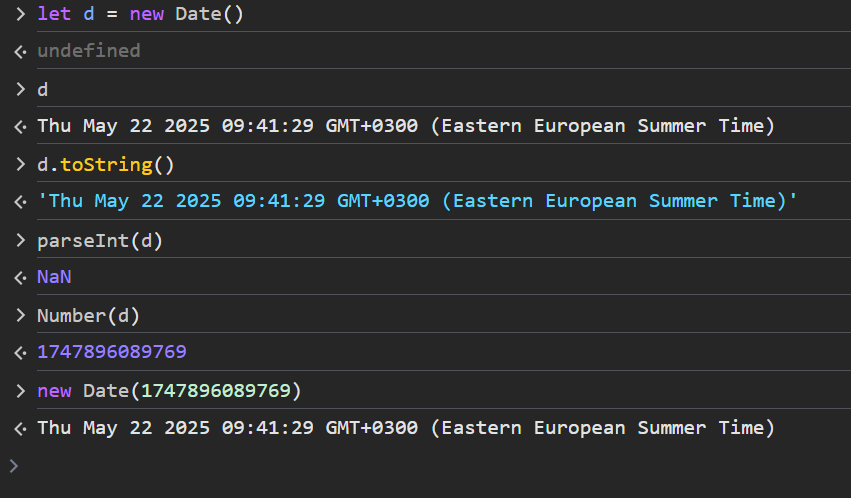
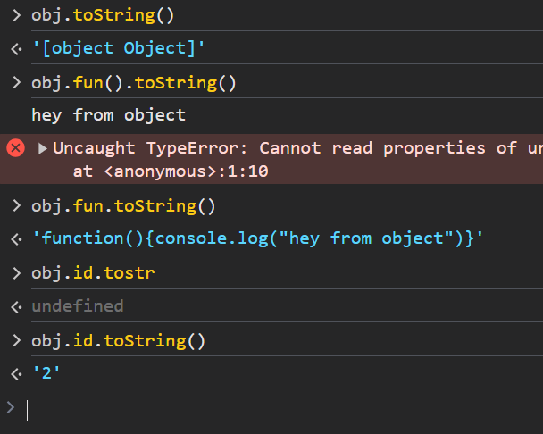

# JavaScript

### Features 
1. Loosely Types Language => not strongly typed Language
2. Object Based Language
  - User Defined Objects
  - Language Objects (Number , Math, Date, String, ..)
  - Browser Objects (Navigator, Window, History ,... ) => BOM
  - HTML Objects => DOM
3. Interpredted Language
- From Top to Bottom : Left To Right 
4. Event Handling
5. Integrated With HTML
- Manipulate Elements
6. Case Sensitive
7. Primitive Types in js is Immutable | if you change the value of a variable it will take another space in memory and the old value the garpage collector remove it 


```HTML
 <!-- you can't write script inside script tag in html if you use external file -->

<script src="index.js">
  console.log("hello"); // this line ignored
</script>

```
---------------------

> If user doesn't allow js to run on browser 
```HTML
<!-- This script runs only of the user disabled the JavaScript from browser  -->
<noscript><h1>Enable JavaScript</h1> </noscript>
```

## Types
```JavaScript
var x; // Without initial values the typeof x is undefined and the value is undefined
x = 10; // typeof x is number and the value is 10
x = null // the typeof x is object and the value is null 
/*
  x ==> is a reference to object in memory heap 
  x ==> is the name of the stack address like 0x23a34 
*/
```

> to declare variable from type number
*** Number is js is DOUBLE == 8 bytes ***
# Types Declaration 

- literal creation
  ```JavaScript
    var x = 10;
    x.toFixed(2); // js create wrapper object from type number for the 'x' variable to deal with it as an object and use 'Number' Methods
    // js will create wrapper Object
    // var wrapperobject = new Number(x);
  ```
- constructor creation => use key word new plus prototype name 
```JavaScript

  var x = new Number(10);
  var y = new Number(10);
  
````


```JavaScript

  // if we assign the x to y 
  x = y;
  // we assign the references so they will have the same value 
````


```JavaScript
var x = 10;

x.toFixed(2); // "10.00" --> it's string 


var y = new Number(10);
// x == y // true 
var z = new Number(10);

z.valueOf() == y.valueOf(); // true

z = y;

z == y; // true cause now they are have the same state and reference to the same object with the same value
```


## Adding user method to a Type Class 'Number, String, Array ...'

- In case we create an object
```JavaScript
var myNumber = new Number(100);

myNumber.sayHello = function () {
  alert('Hello World');
}
myNumber.sayHello();
```

- In case we create literal variable
```JavaScript
var x = 10;
x.sayHello= function (){
  alert("hello from literal declaration");
}(); // here we call it | cause it will note be usable after this line 
// js will create the wrapper object then delete it after this line 
x.sayHello(); // this going to give you error 
````

# Number Literals
```JavaScript
// decimal
var x = 4234; 
// hexdecimal
var x = 0x23a34;
// octal
var x = 010;
// binary
var x = 0110101;

// big numbers 
var x = 10e8;//  1000000000

```
## Number Type Methods and members 
> Max Number in js is Quadrillion 10e15
```JavaScript
var x = 10;
Number.isInteger(x);//true

var x = 10;
// use it in case you want to make two or more namber have the same digits NOT FOR CALCULATION
x.toPrecision(3) //10.0
// Add Digists after the decimal point | It round the number to closest number 10.45 => x.toFixed(1) => 10.5
x.toFixed(2); //10.00
x.toString(2); // 2 to 36 radix | 2 for binary , 10  for decimal , 16 for hexa

var y = 123123;
y.toLocaleString('ar-EG'); // 123,123 
var date  = new Date();
date.toLocaleDateString('ar-EG'); // 21 / 5 / 2025 | us => 5 / 21/ 2025
```


> Js Exception 
```js 
// if you caclulate two float numbers one of them double the other they return a diffirent value
0.1 + 0.2 = 0.3000000000000000004

0.2 + 0.4 = 0.6000000000000000001

```

# Dialogues


*** Void Functions in js return undefined ***
# Parsing


## Parsing Objects 
- Js have main "Object" includes a methods and properties 
- The parseInt(object) | This happens when you pass object to parseInt()
  1. it calls toString()
  2. parse the value inside it

## Parsing with dates 
> date represents in millisecond if you parse using Number()


## Parsing with Other types 
- use "Number()" instead of "parseInt()" in most cases cause it's safe 


# Number | + 
- they are equivalent to each other just for readability 


# Concatenation 


# Implicit  with operation 



# NaN

# Finite -> opposite of the NaN

- undefined with any operator will give you NaN

## Infinity 


-----
# Scopes in ES5 
- There are just two types of scopes 
  1. Function scope => variable only readable inside the function 
  2. Global scope => variables readable all over the script 
  


# Check the variable types using 'constructor'

- if you declare the variable Literal creation or Constructor Creation 
> This is the right way to check the type of the variable 
```javascript

var a = 20;
var b = new Number(18);

a.constructor.name; // Number 
b.constructor.name; // Number 

var name = 'name';
var str = new String('name');

name.constructor.name; // String
str.constructor.name; // String 
```
----- 
# Strings 


## String Methods and Property  
- String object has it's own properties and methods 

### Inquire methods
```javascript 
          // 0 1 2 3 4
var name = "hello",
// length is a readonly property 
name.length; // 5

// charAt() = > return string only '' or 'h'
name.charAt(2);// l
name.charAt(5); // ''
// or 

name[2] // l
name[0] // h
name[5] // undefined 

/**********************/

// indexOf(searchString, Position To start from)

var name = "dude";
name.indexOf('u');//
name.indexOf('du'); //
name.indexOf('d',1) // 2
var name = "Dude";
name.indexOf('de');//
//2

var name = "Dude";
name.indexOf('Du');//
//0

var name = "Dude";
name.indexOf('De');//
//-1

// lastIndexOf
name = "hello"; //'hello'
name.lastIndexOf("l");//3
name.indexOf("l"); //2
```


## Manipulate Methods
```javascript
// 1. substring(start,end?) // end not included 
var name = "hello humen";

name.substring(0,2); // he -> return from index 0 to index 1 | 2 not included 
name.substring(1) // ello humen  -> start from the index 1 to the end of the string 
name.substring(4,1) // ell -> swap two values and
name.substring(-1) // start from index 0 to the end of the string 
name.substring(5,-1) // swap and start from 0 

// 2. substr(startposition, length) length == steps
name.substr(0,3) // hel  // start from index 
name.substr(2,3) // llo // start from index 2 and 3 character after 
name.substr(3,0) // '' // start from 3 and stop 
name.substr(-4) // umen // start from the end 
name.substr(-2,1) // e // start from -2 from the end and move one step

// 3. slice(start,end?)
name.slice(-3) // men // the main different between slice and substring  negative number start from the end 

// ------------
// Splitting 
// case sensitive 
// split(splitter) // the place to split from 
var name = 'test';
name.split('s'); // [te,t]
name.split('t'); // ['', 'es' ,'']
name.split('') // return each character [t,e,s,t]
name.split('2')// ['test'] // return same value in array 
// --------------------------

// Formatting 
// toUpperCase()
var name = 'test';
name.toUpperCase(); // TEST

// toLowerCase()
name = "TesT";
name.toLowerCase() // test
```
- change string character from lower to upper and reverse with immutable variables 


### Replacing 
```javascript
// replace (string to replace, replace string )
var text = "hello humen";
text.replace('e', '@');// h@llo humen

// replace (regex , replace string)
// l => is the character to replace 
text.replace(/l/ig,'@'); // he@@o humen 
// i => means incase sensitive  g => globally , to the end of string

```
---- 

## Tasks


